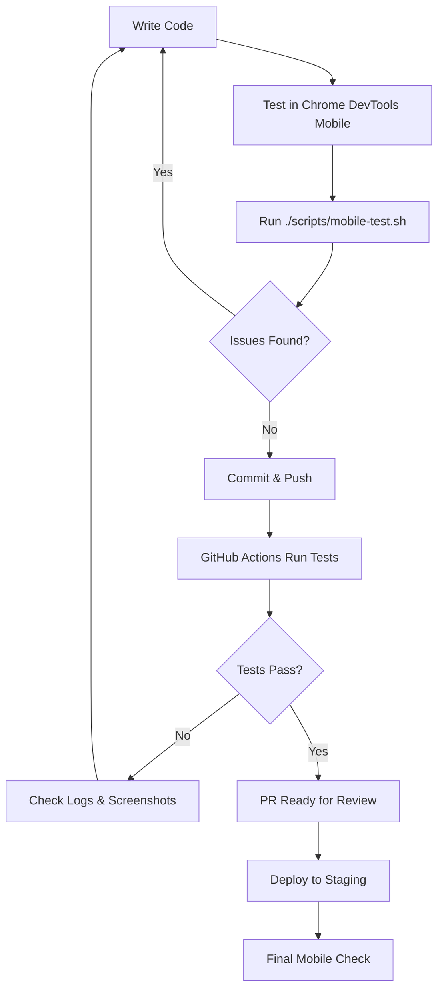

# Mobile Testing Automation - How It Works

## Overview: 3 Layers of Protection

### 1. 🖥️ Local Testing (Manual - Before You Commit)
**Script:** `./scripts/mobile-test.sh`
**When:** Run manually before committing changes
**What it does:** Quick local checks for common mobile issues

### 2. 🤖 CI/CD Testing (Automatic - On Pull Requests)
**Workflow:** `.github/workflows/mobile-testing.yml`
**When:** Automatically runs when you create a PR
**What it does:** Comprehensive mobile testing with screenshots

### 3. 🚀 Deployment Testing (Automatic - After Deploy)
**Workflow:** Part of existing deployment pipeline
**When:** After deployment to staging/production
**What it does:** Verifies mobile experience on live site

## Layer 1: Local Testing Script

### How to Use
```bash
# Before committing any changes:
./scripts/mobile-test.sh

# What you'll see:
# ✓ Viewport meta tag found
# ✓ Found 15 media queries  
# ⚠ Found 3 potentially small touch targets
# ✓ All images are reasonably sized
```

### What It Checks
1. **Viewport Meta Tag** - Required for mobile rendering
2. **Responsive CSS** - Looks for media queries
3. **Touch Targets** - Warns about small buttons
4. **Horizontal Scroll** - Detects overflow issues
5. **Image Sizes** - Flags images over 500KB
6. **Font Sizes** - Ensures readable text
7. **Interaction Patterns** - Warns about hover-only features

### When to Run
- ✅ After changing CSS
- ✅ After adding new components
- ✅ After adding images
- ✅ Before pushing to GitHub

## Layer 2: Automated CI/CD Testing

### How It Works
1. **You push code** to staging/main branch
2. **GitHub Actions triggers** automatically
3. **4 parallel jobs run:**
   - Lighthouse mobile audit
   - Screenshot generation
   - CSS validation
   - Performance checks
4. **Results appear** in PR comments/checks

### What Gets Tested Automatically

#### Lighthouse Mobile Tests
```yaml
# Runs Google Lighthouse in mobile mode
# Checks:
- Performance score
- Accessibility score (must pass)
- Best practices (warnings ok)
- SEO score
```

#### Screenshot Tests
```yaml
# Takes screenshots on these devices:
- iPhone 12
- iPhone SE  
- Pixel 5
- iPad Mini
- Galaxy S20

# Captures:
- Full page view
- Interactive states (menu open, etc.)
```

#### CSS Validation
```yaml
# Scans your CSS for:
- Fixed pixel widths (bad for mobile)
- Missing viewport tags
- Hover-only interactions
```

### Where to See Results
1. Go to your PR on GitHub
2. Check the "Checks" tab
3. Click on failed checks to see details
4. Download artifacts (screenshots) from Actions tab

## Layer 3: Post-Deployment Verification

### Automatic Checks After Deploy
The existing deployment workflow includes mobile verification:
- Loads site on mobile viewport
- Checks core functionality
- Verifies responsive behavior

## Setting Up Your Dev Environment

### 1. Chrome DevTools (Recommended)
```bash
# While developing:
1. Open Chrome DevTools (F12)
2. Click device icon (Ctrl+Shift+M)
3. Select "iPhone 12" from dropdown
4. Refresh page and test
```

### 2. Live Mobile Testing
```bash
# Test on your actual phone:
1. cd site
2. python -m http.server 8000
3. Find your computer's IP: ifconfig | grep inet
4. On phone: visit http://YOUR_IP:8000
```

### 3. VS Code Extensions
Install these for better mobile development:
- **Live Server** - Right-click HTML → "Open with Live Server"
- **Responsive Viewer** - See multiple sizes at once

## Common Scenarios

### Scenario 1: "I'm adding a new section"
```bash
1. Write your HTML/CSS
2. Open Chrome DevTools mobile view
3. Test interaction on mobile size
4. Run: ./scripts/mobile-test.sh
5. Fix any warnings
6. Commit and push
```

### Scenario 2: "PR failed mobile tests"
```bash
1. Click "Details" on the failed check
2. Read the error message
3. Download screenshot artifacts
4. Fix the issue locally
5. Test with ./scripts/mobile-test.sh
6. Push fix to same branch
```

### Scenario 3: "Site looks weird on friend's phone"
```bash
1. Check which device they have
2. Open Chrome DevTools
3. Select that specific device
4. Reproduce and fix issue
5. Add test case to prevent regression
```

## Quick Reference

### Must Run Manually
- `./scripts/mobile-test.sh` - Before commits
- Chrome DevTools testing - During development
- Real device testing - Before major releases

### Runs Automatically
- GitHub Actions mobile tests - On every PR
- Lighthouse audits - On every PR
- Screenshot generation - On every PR
- Post-deployment checks - After deploy

### Red Flags That Block PR
- Missing viewport meta tag
- Lighthouse accessibility < 90
- JavaScript errors on mobile
- Build failures

### Yellow Warnings (Won't Block)
- Large images (but should fix)
- Small touch targets
- Performance score < 90
- Hover-only interactions

## Typical Workflow



## Pro Tips

1. **Develop mobile-first** - Start with mobile view open
2. **Test early and often** - Don't wait until the end
3. **Use real devices** when possible for final testing
4. **Check both orientations** - Portrait and landscape
5. **Test on slow network** - Not everyone has 5G

## Getting Help

If mobile tests fail and you're stuck:
1. Check the error message carefully
2. Look at the screenshot artifacts
3. Test the specific failing scenario locally
4. Ask for help with the specific error

The automation is here to help catch issues early, not to make life difficult!